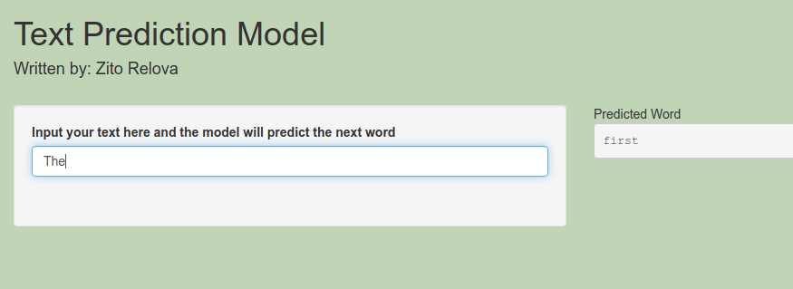

# Text Prediction Model
A simple text prediction model using n-grams written in R.

You can view the application [here.](https://zrelova.shinyapps.io/Text-Prediction-Model/)

Simply type a string into the textbox and the model will automatically predict the next word.

